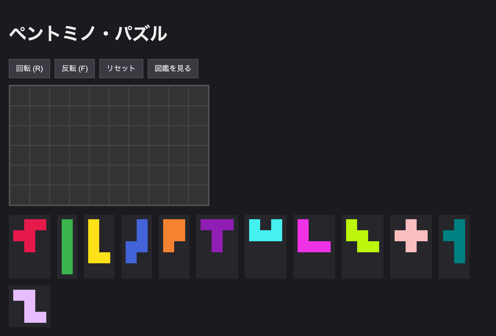
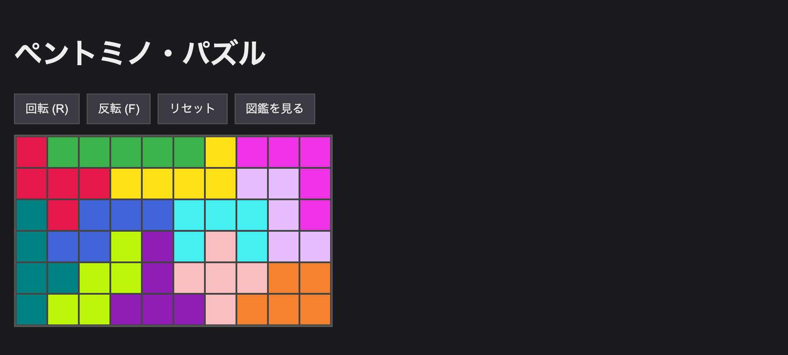
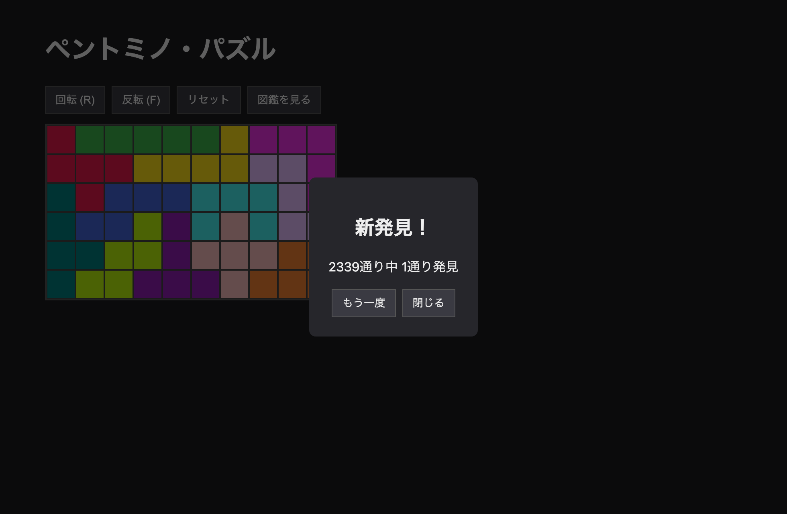

# ペントミノ・パズル

12種類のペントミノを 6×10 の盤にすき間なく敷き詰める、ブラウザで遊べるパッキングパズルです。
盤の敷き詰め方は **2,339 通り**あり、見つけた解を図鑑のように集めていけます。

> ポリオミノのパッキングパズルを題材にした、フロントエンド完結（バックエンドなし）の Web アプリです。

## スクリーンショット

| プレイ画面 | 完成した盤 |
| --- | --- |
|  |  |

12 ピースすべてを敷き詰めると「新発見！」ダイアログが表示され、2,339 通り中いくつ目の解かを知らせます。



## 特徴

- **ドラッグ＆ドロップ操作**：トレイのピースを盤へドラッグして配置。盤上のピースもつかんで動かせます。
- **回転・裏返し**：選択中のピースを `R` で 90° 回転、`F` で裏返し。
- **ドロップ先ハイライト**：ドラッグ中、置ける場所は緑・置けない場所は赤で表示。
- **完成判定と演出**：12 ピースすべてが収まると完成ダイアログを表示。
- **図鑑（コレクション）**：見つけた解を「2,339 通り中 ○通り発見」として記録。サムネイル一覧＋クリックで拡大表示。
- **対称性による重複排除**：盤の 4 つの対称変換（恒等・180°回転・左右反転・上下反転）で等価な解は同一とみなし、二重にカウントしません。
- **自動保存**：進行中の盤と図鑑を localStorage に保存し、リロードしても復帰。保存できない環境（プライベートモード等）では通知を表示します。

## 遊び方

1. トレイのピースを盤の上へドラッグします。
2. ドラッグ中に `R`（回転）／`F`（裏返し）で向きを変えられます。
3. 置ける位置は緑、置けない位置は赤でハイライトされます。合法な位置で離すと確定します。
4. 盤上のピースは、つかんで盤外へドラッグするとトレイに戻せます。
5. 12 ピースすべてを敷き詰めると完成です。新しい解なら「新発見！」と表示され、図鑑に記録されます。

## セットアップ

```bash
npm install     # 依存関係のインストール
npm run dev     # 開発サーバー起動（http://localhost:5173/）
```

### その他のコマンド

```bash
npm test        # テスト実行（Vitest）
npm run build   # 型チェック＋本番ビルド（tsc -b && vite build）
npm run preview # ビルド成果物のプレビュー
npm run lint    # oxlint
```

## 技術スタック

- [Vite](https://vite.dev/) + [React 19](https://react.dev/) + [TypeScript](https://www.typescriptlang.org/)
- 状態管理：React 標準の `useReducer` + Context（外部ライブラリなし）
- ドラッグ：Pointer Events を用いた自作フック
- 永続化：localStorage
- テスト：[Vitest](https://vitest.dev/) + [@testing-library/react](https://testing-library.com/)（jsdom）

## 設計方針

UI とパズルロジックを疎結合にした層構造です。`src/puzzle/` は React に一切依存しない純ロジックとして単体テストで固め、その上に React の UI を乗せています。

```
src/
  puzzle/        # React 非依存の純ロジック
    pieces.ts    #   12ペントミノの定義とオリエンテーション生成
    board.ts     #   盤モデル・配置の合法性判定・完成判定
    solution.ts  #   解の正規化（対称性による重複排除）
    geometry.ts  #   ドラッグ座標の計算
  state/         # 状態管理
    gameReducer.ts   #   状態遷移（常に合法な配置のみ許可）
    GameContext.tsx  #   Context provider ＋ 永続化の配線
  storage/       # localStorage 読み書き（図鑑・進行状況）
    collection.ts
  hooks/         # ポインタ追従ドラッグ
    usePointerDrag.ts
  components/     # UI（Board / Tray / PieceShape / Controls / Collection / SolvedDialog / StorageNotice）
  App.tsx
```

**不変条件**：盤上の配置は常に合法（盤内かつ重なりなし）に保たれます。配置・回転・裏返し、および保存状態からの復帰のいずれの経路でも、この条件を満たさない盤は生じません。

設計・実装の詳細は `docs/superpowers/` 以下にまとめてあります。

- 設計書：`docs/superpowers/specs/`
- 実装計画：`docs/superpowers/plans/`

## テスト

パズルロジック（ピースのオリエンテーション生成、配置の合法性、対称性による重複排除）を中心に、完成 → ダイアログ → 図鑑保存という一連の流れを実際のモジュールで検証する統合テストまで含めています。

```bash
npm test
```
